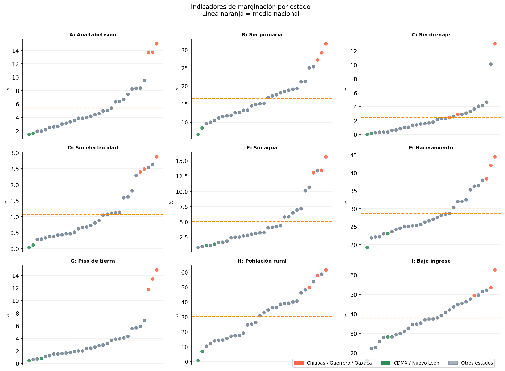
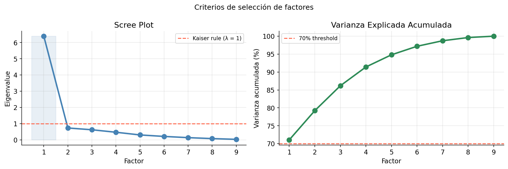
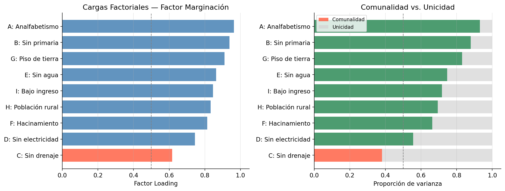
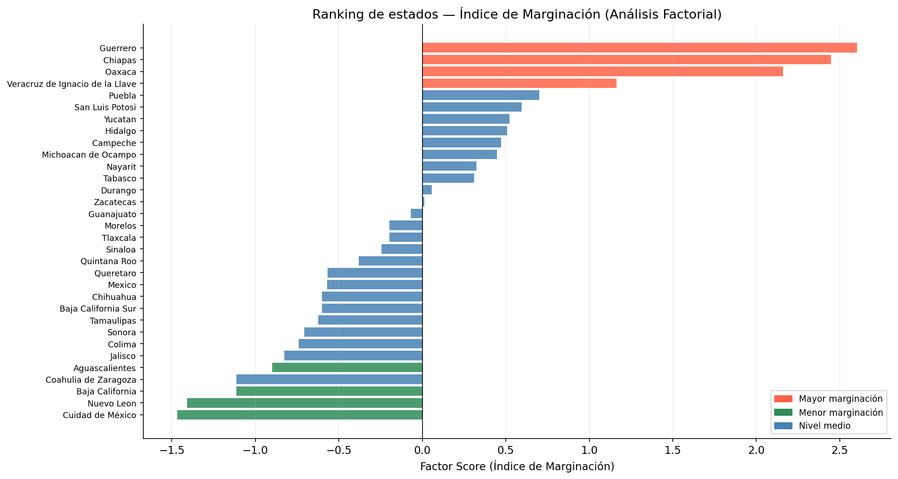
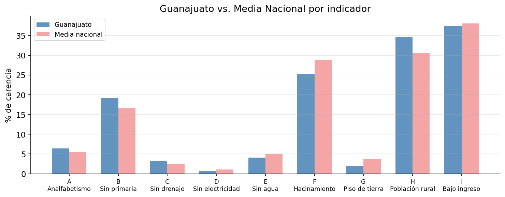

## Introducción

¿Cómo se mide algo que no se puede observar directamente, como la "marginación"?

No puedes entrar a un estado y leer un número. Pero sí puedes medir muchos síntomas correlacionados: tasas de analfabetismo, falta de agua corriente, hacinamiento, bajos ingresos. El **Análisis Factorial** es la herramienta estadística que toma un conjunto de variables observadas correlacionadas y pregunta: ¿qué *factor latente* está impulsando todas ellas?

En este tutorial aplicamos Análisis Factorial a los indicadores de marginación del CONAPO en los 32 estados de México. El resultado es una puntuación compuesta — un **Índice de Marginación** — que clasifica los estados de mayor a menor privación y revela *cuáles* privaciones importan más.

**Lo que aprenderás:**

- Cómo difiere el Análisis Factorial de PCA y cuándo usar cada uno
- Cómo verificar si tus datos son adecuados (Bartlett + KMO)
- Cómo elegir el número de factores con valores propios y el scree plot
- Cómo interpretar las cargas factoriales y las comunalidades
- Qué hace la rotación — y por qué es menos relevante con un solo factor

**Fuente de datos:** CONAPO (Consejo Nacional de Población) — indicadores de marginación por estado, basados en datos censales del INEGI. 32 estados × 9 indicadores. Código y datos disponibles en [github.com/ivandeluna/data-science-notebooks](https://github.com/ivandeluna/data-science-notebooks) (carpeta `08-metodos-multivariados/`).

---

## El Dataset: Indicadores de Marginación CONAPO

El CONAPO construye su índice de marginación a partir de nueve indicadores, cada uno midiendo el **porcentaje de la población que carece** de un bien o servicio básico. Valores más altos = mayor privación.

| Código | Indicador |
|--------|-----------|
| A | % Población de 15+ años analfabeta |
| B | % Población de 15+ años sin primaria completa |
| C | % Viviendas sin drenaje ni sanitario |
| D | % Viviendas sin electricidad |
| E | % Viviendas sin agua entubada |
| F | % Viviendas con hacinamiento |
| G | % Viviendas con piso de tierra |
| H | % Población en localidades con menos de 5,000 habitantes (rural) |
| I | % Población ocupada con ingreso ≤ 2 salarios mínimos |

Estos indicadores se agrupan temáticamente en: **privación educativa** (A, B), **infraestructura de vivienda** (C, D, E, F, G) y **marginalidad económica/geográfica** (H, I).

```python
import numpy as np
import pandas as pd
import matplotlib.pyplot as plt
import matplotlib.patches as mpatches
import seaborn as sns
from scipy import stats
from factor_analyzer import FactorAnalyzer
from factor_analyzer.factor_analyzer import calculate_kmo, calculate_bartlett_sphericity
import warnings
warnings.filterwarnings('ignore')

plt.rcParams.update({
    'figure.dpi': 120,
    'axes.spines.top': False,
    'axes.spines.right': False,
    'font.size': 11,
})
```

```python
df = pd.read_excel('pobreza.xlsx')
df.columns = ['estado'] + list('ABCDEFGHI')
df['estado'] = df['estado'].str.strip()

VARS = list('ABCDEFGHI')
LABELS = {
    'A': 'Analfabetismo',   'B': 'Sin primaria',
    'C': 'Sin drenaje',     'D': 'Sin electricidad',
    'E': 'Sin agua',        'F': 'Hacinamiento',
    'G': 'Piso de tierra',  'H': 'Población rural',
    'I': 'Bajo ingreso'
}

print(f"Dataset: {df.shape[0]} estados × {len(VARS)} indicadores")
df.head()
```

```
Dataset: 32 estados × 9 indicadores

         estado     A      B     C     D     E      F     G      H      I
Aguascalientes  2.60  11.89  0.67  0.30  0.81  21.86  0.75  25.16  34.60
Baja California 1.96  10.46  0.26  0.47  2.82  23.03  1.15  10.35  22.85
...
```

---

## Análisis Exploratorio

### ¿Qué estados tienen mayor privación general?

Un gráfico de puntos — un punto por estado, un panel por indicador — nos permite identificar qué estados aparecen consistentemente en la parte superior (mayor privación).

```python
df_long = df.melt(id_vars='estado', value_vars=VARS,
                  var_name='indicator', value_name='pct')

HIGHLIGHT = {
    'Chiapas': 'tomato', 'Guerrero': 'tomato', 'Oaxaca': 'tomato',
    'Cuidad de México': 'seagreen', 'Nuevo Leon': 'seagreen',
}

fig, axes = plt.subplots(3, 3, figsize=(14, 10))
for i, var in enumerate(VARS):
    ax = axes.flatten()[i]
    sub = df_long[df_long['indicator'] == var].sort_values('pct')
    colors = [HIGHLIGHT.get(s, 'slategrey') for s in sub['estado']]
    ax.scatter(range(len(sub)), sub['pct'], c=colors, s=35, alpha=0.85)
    ax.axhline(sub['pct'].mean(), color='darkorange', linewidth=1.5, linestyle='--')
    ax.set_title(f'{var}: {LABELS[var]}', fontweight='bold', fontsize=9.5)
    ax.set_ylabel('%', fontsize=8); ax.set_xticks([]); ax.grid(True, alpha=0.2)
plt.tight_layout()
plt.show()
```



Chiapas, Guerrero y Oaxaca aparecen en la cima de prácticamente todos los indicadores — confirmando que están estructuralmente marginados en educación, vivienda e ingresos. Nuevo León y CDMX se sitúan consistentemente en la parte baja.

Nótese también que los indicadores tienen *escalas muy diferentes*: el analfabetismo (A) llega al 15% mientras que la población rural (H) alcanza el 62%. Esto hace que la estandarización sea esencial antes de ejecutar el Análisis Factorial.

---

## Pruebas de Normalidad

El Análisis Factorial (especialmente el método de Máxima Verosimilitud) asume que las variables siguen una distribución aproximadamente normal. Probamos cada indicador con la prueba de **Shapiro-Wilk**:

- H₀: la variable sigue una distribución normal
- Rechazar H₀ si p < 0.05

```python
print(f"{'Var':<4} {'Indicador':<22} {'W':>12} {'p-valor':>10} {'Resultado':>15}")
print("-" * 68)
for v in VARS:
    stat, p = stats.shapiro(df[v])
    result = "Normal ✓" if p > 0.05 else "No normal ✗"
    print(f"{v:<4} {LABELS[v]:<22} {stat:>12.4f} {p:>10.4f} {result:>15}")
```

```
Var  Indicador               W statistic    p-valor          Resultado
--------------------------------------------------------------------
A    Analfabetismo                0.8563     0.0006       No normal ✗
B    Sin primaria                 0.9484     0.1296           Normal ✓
C    Sin drenaje                  0.7096     0.0000       No normal ✗
D    Sin electricidad             0.8710     0.0012       No normal ✗
E    Sin agua                     0.8306     0.0002       No normal ✗
F    Hacinamiento                 0.9214     0.0228       No normal ✗
G    Piso de tierra               0.7492     0.0000       No normal ✗
H    Población rural              0.9626     0.3236           Normal ✓
I    Bajo ingreso                 0.9902     0.9899           Normal ✓
```

Solo **B** (sin primaria), **H** (población rural) e **I** (bajo ingreso) pasan la prueba de normalidad. Las demás — especialmente **C** (sin drenaje) y **G** (piso de tierra) — tienen una asimetría marcada, con unos pocos estados con valores extremadamente altos.

Esto significa que debemos interpretar los resultados del método ML con cierta cautela. Usaremos el método de **Ejes Principales** (*Principal Axis*) como modelo primario, ya que hace menos supuestos distribucionales.

---

## ¿Son Estos Datos Adecuados para el Análisis Factorial?

Dos pruebas evalúan si la estructura de correlaciones justifica el uso de Análisis Factorial:

La **Prueba de Esfericidad de Bartlett** verifica si la matriz de correlaciones es significativamente diferente de una matriz identidad (es decir, que las variables están efectivamente correlacionadas). Si no se puede rechazar esta prueba, el Análisis Factorial no tiene nada con qué trabajar.

El **Kaiser-Meyer-Olkin (KMO)** mide qué proporción de las correlaciones entre variables puede explicarse por factores comunes. Valores sobre 0.6 son aceptables; sobre 0.8 es bueno.

```python
X = df[VARS].values

chi2, p_bartlett = calculate_bartlett_sphericity(X)
print(f"Bartlett: χ² = {chi2:.2f},  p-valor = {p_bartlett:.2e}")

kmo_per_var, kmo_overall = calculate_kmo(X)
print(f"KMO global: {kmo_overall:.4f}")
```

```
=== Prueba de Esfericidad de Bartlett ===
  χ² = 278.84,  p-valor = 2.56e-39
  → Se rechaza H₀: la matriz de correlaciones NO es una identidad.
  → El Análisis Factorial es apropiado.

=== Kaiser-Meyer-Olkin (KMO) ===
  KMO global: 0.8861  →  Bueno

  Var  Indicador               KMO  Clasificación
  A    Analfabetismo         0.8435           Bueno
  B    Sin primaria          0.9024       Excelente
  C    Sin drenaje           0.9104       Excelente
  D    Sin electricidad      0.8727           Bueno
  E    Sin agua              0.8943           Bueno
  F    Hacinamiento          0.9205       Excelente
  G    Piso de tierra        0.8469           Bueno
  H    Población rural       0.8893           Bueno
  I    Bajo ingreso          0.9329       Excelente
```

Ambas pruebas confirman que los datos son muy adecuados para el Análisis Factorial: Bartlett es altamente significativo (p ≈ 0), las variables están fuertemente correlacionadas, y el KMO de **0.89 (Bueno, casi Excelente)** indica que la mayor parte de las correlaciones son impulsadas por factores comunes.

---

## ¿Cuántos Factores Retener?

Antes de extraer factores, necesitamos decidir cuántos retener. El **scree plot** (valores propios de la matriz de correlaciones) nos da dos criterios:

1. **Regla de Kaiser**: retener factores con valor propio > 1
2. **Criterio del codo**: buscar la "rodilla" en la curva

```python
corr_matrix = np.corrcoef(X.T)
eigenvalues = np.linalg.eigvalsh(corr_matrix)[::-1]
cumulative_var = np.cumsum(eigenvalues) / eigenvalues.sum()

# Scree plot + varianza acumulada
fig, axes = plt.subplots(1, 2, figsize=(12, 4))
axes[0].plot(range(1, len(eigenvalues)+1), eigenvalues, 'o-',
             color='steelblue', linewidth=2.5, markersize=8)
axes[0].axhline(1, color='tomato', linestyle='--', label='Regla de Kaiser (λ = 1)')
# ...
plt.show()
```



```
Factor 1: λ = 6.3950  |  Acumulado = 71.1%  ← único por encima de Kaiser
Factor 2: λ = 0.7349  |  Acumulado = 79.2%
Factor 3: λ = 0.6249  |  Acumulado = 86.2%
...
```

El resultado es inusualmente claro: **el Factor 1 tiene un valor propio de 6.39**, explicando el **71% de la varianza total** — y el segundo cae a 0.73, *por debajo* del umbral de Kaiser. El codo en el Factor 1 es inequívoco.

Un factor dominante con este nivel de poder explicativo es una señal fuerte de que estos nueve indicadores están midiendo esencialmente *una sola cosa*: un eje general de marginación que va desde la privación estructural hasta la prosperidad relativa.

---

## Extrayendo el Factor: El Índice de Marginación

Ajustamos un modelo de 1 factor usando el método de **Ejes Principales**. Para cada variable obtenemos:

- **Carga (Loading)**: correlación entre la variable y el factor latente
- **Comunalidad**: proporción de la varianza de la variable explicada por el factor (= carga²)

Una comunalidad menor a 0.5 indica que el factor no captura bien esa variable.

```python
fa = FactorAnalyzer(n_factors=1, rotation=None, method='principal')
fa.fit(X)

loadings   = fa.loadings_.flatten()
communalities = fa.get_communalities()
```



```
Factor explica 71.1% de la varianza total

           Variable  Carga  Comunalidad
     C: Sin drenaje  0.617        0.381  ← communality < 0.5
D: Sin electricidad  0.745        0.555
    F: Hacinamiento  0.814        0.663
 H: Población rural  0.833        0.693
    I: Bajo ingreso  0.847        0.717
        E: Sin agua  0.864        0.746
  G: Piso de tierra  0.911        0.830
    B: Sin primaria  0.938        0.880
   A: Analfabetismo  0.964        0.930
```

**Leyendo las cargas:** Las tres cargas más fuertes son **A (analfabetismo, 0.96)**, **B (sin primaria, 0.94)** y **G (piso de tierra, 0.91)**. Son marcadores clásicos de pobreza extrema — cargan fuertemente en el factor único porque donde el analfabetismo es alto, los pisos de tierra también tienden a serlo.

**La excepción: C (sin drenaje)** tiene una carga de solo 0.62 y una comunalidad de 0.38 — por debajo de 0.5. El acceso a drenaje en México tiene un patrón parcialmente independiente de la marginación general (depende de la inversión municipal en infraestructura y la geografía de formas que otros indicadores no), por lo que el modelo de un solo factor lo captura con menor precisión.

---

## Rotación Factorial: Varimax y Promax

Con más de un factor, la rotación ayuda a hacer la estructura factorial más interpretable maximizando la asociación de cada variable con un solo factor. Existen dos tipos:

- **Varimax** (ortogonal): los factores permanecen no correlacionados — más limpio pero asume independencia
- **Promax** (oblicuo): permite que los factores se correlacionen — más realista para datos sociales

**Con un solo factor, la rotación no tiene efecto** — no hay nada que rotar. Ajustamos ambas rotaciones para ilustrar que las cargas son idénticas, lo que confirma la robustez de nuestra solución de 1 factor.

```python
fa_varimax = FactorAnalyzer(n_factors=1, rotation='varimax', method='ml')
fa_promax  = FactorAnalyzer(n_factors=1, rotation='promax',  method='ml')
fa_varimax.fit(X); fa_promax.fit(X)
```

```
Cargas bajo tres métodos de rotación:
          Indicador  Sin rotación  Varimax  Promax
   A: Analfabetismo        0.9642   0.9895  0.9895
    B: Sin primaria        0.9378   0.9527  0.9527
     C: Sin drenaje        0.6174   0.5533  0.5533
     ...

Nota: Con un solo factor, Varimax y Promax producen resultados idénticos.
La rotación es relevante solo cuando hay 2+ factores que reorientar.
```

---

## Puntuaciones Factoriales: Ranking Estatal

Las puntuaciones factoriales representan la posición de cada estado en el eje de marginación. Se calculan como una combinación ponderada de los indicadores estandarizados, usando las cargas factoriales como pesos.

Puntuaciones positivas = marginación mayor al promedio; negativas = menor al promedio.

```python
scores = fa.transform(X)
score_df = pd.DataFrame({'estado': df['estado'], 'marginacion': scores[:, 0]})
score_df = score_df.sort_values('marginacion', ascending=False)
```



```
Top 5 más marginados:
  1. Guerrero          +2.60
  2. Chiapas           +2.45
  3. Oaxaca            +2.16
  4. Veracruz          +1.16
  5. Puebla            +0.70

Top 5 menos marginados:
 28. Aguascalientes    -0.90
 29. Coahuila          -1.11
 30. Baja California   -1.11
 31. Nuevo León        -1.41
 32. Ciudad de México  -1.47
```

---

## Caso de Estudio: ¿En Qué Debe Enfocarse Guanajuato?

Examinar un estado específico nos permite traducir los resultados del análisis factorial en recomendaciones de política concretas. Guanajuato se ubica en el rango medio del ranking — no entre los más privados, pero con margen claro de mejora.

```python
gto = df[df['estado'].str.contains('Guanajuato')]
gto_vals = gto[VARS].values.flatten()
national_mean = df[VARS].mean().values
```



```
       Indicador  Guanajuato  Media Nac.  Diferencia
   Analfabetismo        6.39        5.45       +0.94  ▲ peor
    Sin primaria       19.12       16.55       +2.57  ▲ peor
 Población rural       34.67       30.61       +4.06  ▲ peor
     Sin drenaje        3.31        2.47       +0.84  ▲ peor
Sin electricidad        0.68        1.07       -0.39  ▼ mejor
        Sin agua        4.13        5.04       -0.91  ▼ mejor
    Hacinamiento       25.36       28.77       -3.41  ▼ mejor
  Piso de tierra        2.00        3.73       -1.73  ▼ mejor
    Bajo ingreso       37.41       38.05       -0.64  ▼ mejor
```

Guanajuato está por encima de la media nacional en **población rural (H)** y **sin primaria (B)** — y estos también tienen cargas factoriales altas, lo que significa que contribuyen significativamente al índice de marginación. Mejorar en estas dos dimensiones tendría el mayor efecto en la puntuación compuesta del estado.

---

## Conclusiones

El Análisis Factorial extrajo una variable latente única y poderosa de los nueve indicadores de marginación del CONAPO — y este factor explica el **71% de la varianza total** en los datos.

**Lo que captura el factor:** Un eje general de pobreza estructural. Los estados que tienen alta analfabetismo también tienden a tener pisos de tierra, falta de agua corriente y bajos salarios. Estas condiciones están tan fuertemente correlacionadas (impulsadas por las mismas fuerzas socioeconómicas subyacentes) que un solo número — la puntuación de marginación — las resume notablemente bien.

**Hallazgos principales:**

- **Indicadores más fuertes**: El analfabetismo (A) y la falta de escolaridad primaria (B) son las variables más correlacionadas con el factor latente — son los "síntomas" más confiables de marginación profunda.
- **Ajuste más débil**: El acceso a drenaje (C) tiene una comunalidad por debajo de 0.5, indicando que responde a factores diferentes (inversión municipal, geografía) más allá de la pobreza general.
- **Persistencia geográfica**: Chiapas, Guerrero y Oaxaca se sitúan muy por encima del resto en el eje de marginación — patrón visible en cada indicador individual y confirmado por la puntuación compuesta.
- **La rotación no cambia la historia**: Con un solo factor, Varimax y Promax producen cargas idénticas. La rotación es relevante cuando hay 2+ factores.

**PCA vs. Análisis Factorial — ¿cuándo usar cada uno?**

|  | PCA | Análisis Factorial |
|---|---|---|
| **Objetivo** | Reducir dimensiones | Encontrar estructura latente |
| **Maximiza** | Varianza total | Varianza común |
| **Mejor para** | Compresión, visualización | Variables latentes con fundamento teórico |
| **Output** | Componentes (combinaciones lineales) | Factores (constructos latentes) |

---

*Tutorial por [Iván de Luna](https://ivandeluna.github.io) · Código y datos en [GitHub](https://github.com/ivandeluna/data-science-notebooks)*
