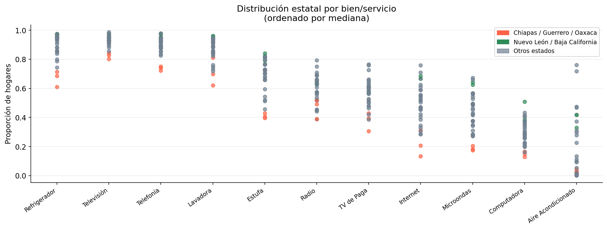
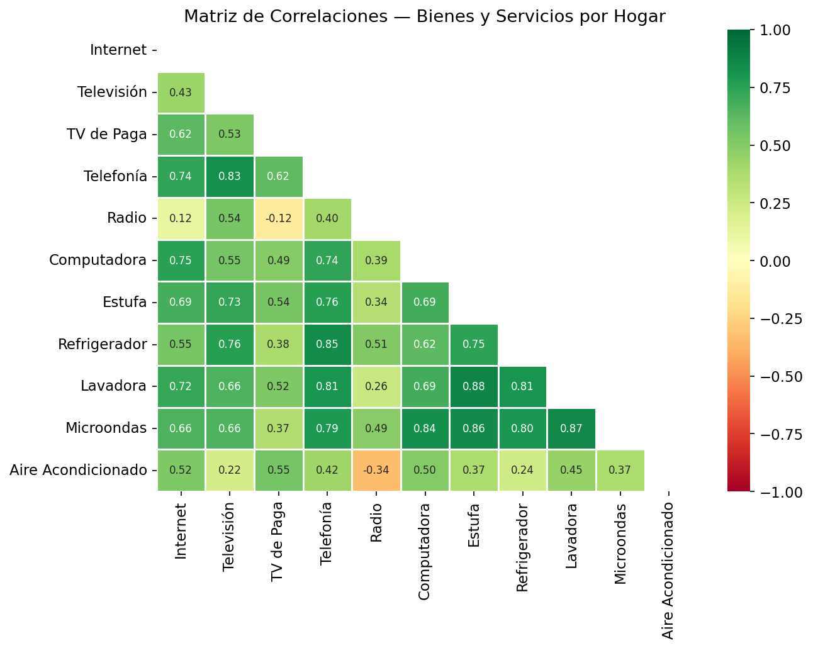
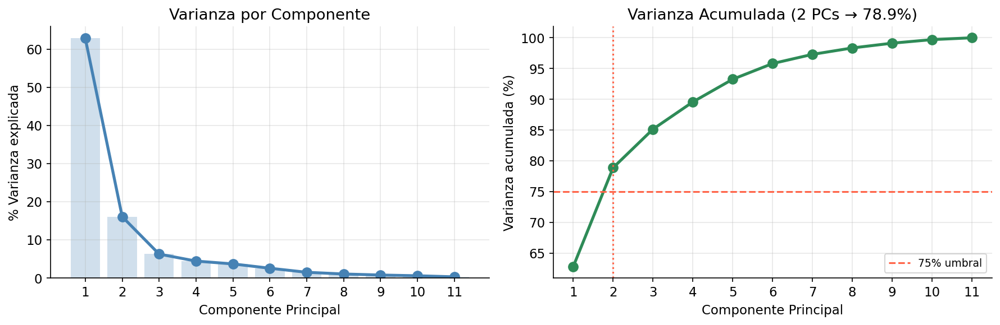
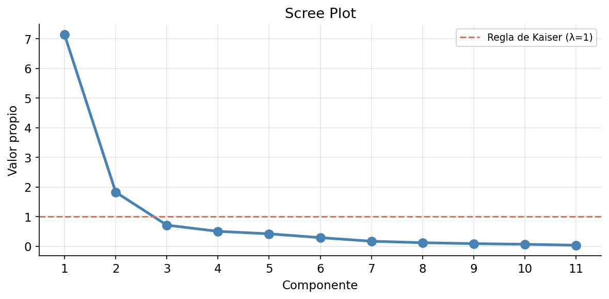
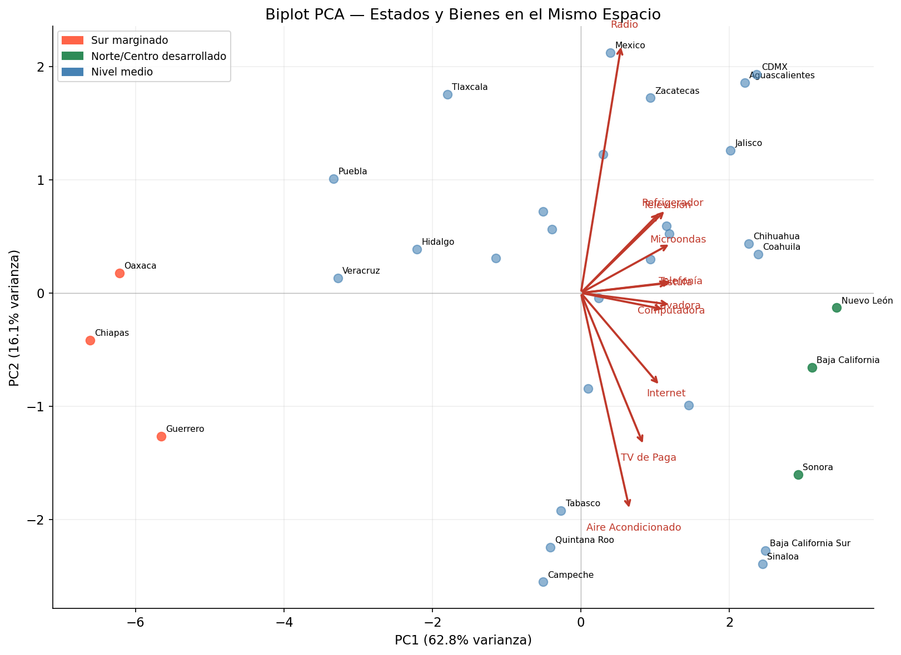

## Introducción

México tiene 32 estados que difieren dramáticamente en ingresos, geografía y acceso a bienes. ¿Cómo resumir esas diferencias en algo manejable? ¿Y qué nos dicen los patrones de consumo de los hogares sobre el desarrollo regional?

El **Análisis de Componentes Principales (PCA)** es la herramienta estándar para este tipo de pregunta. Toma variables correlacionadas — en este caso, las tasas de posesión de bienes y servicios por estado — y las comprime en unas pocas dimensiones que capturan la mayor parte de la variación.

En este tutorial aplicamos PCA a datos del ENIGH sobre 11 bienes y servicios en los 32 estados de México. El resultado es un **mapa bidimensional** donde cada punto es un estado y cada flecha es un bien — y la geometría del mapa revela la estructura económica regional del país.

**Lo que aprenderás:**

- Cómo hacer un EDA multivariado: variación, outliers y correlaciones
- Cómo verificar si los datos son adecuados para PCA (KMO)
- Cómo elegir el número de componentes (varianza acumulada, scree plot, Kaiser)
- Cómo construir e interpretar un **biplot**
- Cuándo usar PCA vs. Análisis Factorial

**Fuente de datos:** ENIGH 2022 (INEGI) — proporción de hogares que poseen cada bien o servicio, por estado. 32 estados × 11 variables. Código y datos en [github.com/ivandeluna/data-science-notebooks](https://github.com/ivandeluna/data-science-notebooks) (carpeta `08-metodos-multivariados/`).

---

## El Dataset

Cada fila es un estado de México. Cada columna es la **proporción de hogares** (0 a 1) que poseen o están suscritos a un bien o servicio.

| Variable | Descripción |
|----------|-------------|
| `internet` | Acceso a internet |
| `television` | Televisión (cualquier tipo) |
| `tv_paga` | Televisión de paga |
| `telefonia` | Telefonía (fija o móvil) |
| `radio` | Radio |
| `computadora` | Computadora o laptop |
| `estufa` | Estufa de gas o eléctrica |
| `refrigerador` | Refrigerador |
| `lavadora` | Lavadora |
| `microondas` | Microondas |
| `aire` | Aire acondicionado |

```python
import numpy as np
import pandas as pd
import matplotlib.pyplot as plt
import seaborn as sns
from sklearn.decomposition import PCA
from sklearn.preprocessing import StandardScaler
from factor_analyzer.factor_analyzer import calculate_kmo

df = pd.read_excel('Hogares_equipo.xlsx')
df.columns = ['estado', 'internet', 'television', 'tv_paga', 'telefonia',
              'radio', 'computadora', 'estufa', 'refrigerador', 'lavadora',
              'microondas', 'aire']

NUMERIC = ['internet','television','tv_paga','telefonia','radio',
           'computadora','estufa','refrigerador','lavadora','microondas','aire']

print(f"Dataset: {df.shape[0]} estados × {len(NUMERIC)} variables")
df.head()
```

```
Dataset: 32 estados × 11 variables

        estado  internet  television  tv_paga  telefonia  radio  ...
Aguascalientes     0.642       0.948    0.498      0.921  0.295  ...
```

---

## Análisis Exploratorio

### ¿Qué bienes varían más entre estados?

El primer paso es siempre entender dónde hay variación y dónde no. Si una variable tiene poca variación, aporta poco a PCA.

```python
df_long = df.melt(id_vars='estado', var_name='variable', value_name='proporcion')

fig, ax = plt.subplots(figsize=(13, 5))
# Dotplot: un punto por estado, paneles por bien
# ordenado por mediana descendente
plt.show()
```



Nótese el contraste en dispersión:

- **Televisión** y **Telefonía** son casi universales — poca variación entre estados
- **Internet**, **Computadora** y **TV de Paga** tienen la mayor dispersión — aquí vive la información más útil para PCA
- **Aire acondicionado** tiene un patrón geográfico distinto: alto en estados norteños por el clima, no necesariamente por nivel de ingresos

Los tres estados del sur — **Chiapas, Oaxaca y Guerrero** — aparecen consistentemente por debajo de la mediana en casi todos los bienes.

### Matriz de correlaciones

PCA funciona mejor cuando las variables están correlacionadas — "comprime" variables correlacionadas en menos dimensiones sin perder mucha información.

```python
corr = df[NUMERIC].corr()
sns.heatmap(corr, annot=True, fmt='.2f', cmap='RdYlGn',
            center=0, vmin=-1, vmax=1)
plt.title('Matriz de Correlaciones — Bienes y Servicios por Hogar')
plt.show()
```



**Qué observar:**

- **Los electrodomésticos forman un clúster**: `Estufa`, `Refrigerador`, `Lavadora` y `Microondas` tienen correlaciones altas (r > 0.7). En México, la posesión de estos bienes va de la mano con el nivel de ingresos del hogar.
- **`Internet` y `Computadora`** están muy correlacionados (r = 0.93) — ambos reflejan acceso digital.
- **`Aire acondicionado`** es el más independiente: correlaciona modestamente con el resto porque responde más a geografía climática (estados del norte y Baja California) que a nivel de ingresos.
- **`Radio`** tiene correlaciones negativas con los bienes modernos — refleja que en estados más rurales y menos conectados, la radio sigue siendo el medio principal.

---

## Prueba de Adecuación: KMO

Antes de aplicar PCA, verificamos si las correlaciones en los datos son lo suficientemente fuertes como para justificarlo. El **Kaiser-Meyer-Olkin (KMO)** mide qué proporción de las correlaciones se explica por factores comunes.

- KMO ≥ 0.9: Excelente
- KMO ≥ 0.8: Bueno
- KMO ≥ 0.7: Aceptable
- KMO < 0.6: Inadecuado

```python
scaler = StandardScaler()
X_std = scaler.fit_transform(df[NUMERIC])

kmo_per_var, kmo_overall = calculate_kmo(X_std)
print(f"KMO global: {kmo_overall:.4f}")
```

```
KMO global: 0.8100  →  Bueno

Variable         KMO
Internet        0.82  Bueno
Televisión      0.81  Bueno
TV de Paga      0.83  Bueno
Telefonía       0.80  Bueno
Radio           0.68  Aceptable
Computadora     0.81  Bueno
Estufa          0.84  Bueno
Refrigerador    0.85  Bueno
Lavadora        0.79  Aceptable
Microondas      0.87  Bueno
Aire Acondic.   0.76  Aceptable
```

Un KMO de **0.81 (Bueno)** confirma que hay suficiente varianza compartida entre las variables para justificar PCA. `Radio` y `Aire Acondicionado` tienen los valores más bajos, consistente con lo que vimos en la matriz de correlaciones — responden a factores más idiosincrásicos.

---

## Selección de Componentes

### Criterio 1 — Varianza Acumulada (≥ 75%)

```python
pca = PCA()
scores = pca.fit_transform(X_std)
ev = pca.explained_variance_ratio_
cumev = np.cumsum(ev)

# ¿Cuántos PCs necesitamos para explicar el 75%?
n_75 = np.argmax(cumev >= 0.75) + 1
print(f"{n_75} componentes explican {cumev[n_75-1]*100:.1f}% de la varianza")
```

```
2 componentes explican 78.9% de la varianza
```



**PC1** sola captura el **62.8%** de la varianza — un valor inusualmente alto que indica una estructura muy clara en los datos: existe un eje dominante de variación que separa a los estados.

### Criterio 2 — Regla de Kaiser (λ > 1)

```python
eigenvalues = pca.explained_variance_
# Retener componentes con valor propio > 1
```



```
PC1: λ = 6.91  ← muy por encima de Kaiser
PC2: λ = 1.77  ← justo por encima de Kaiser
PC3: λ = 0.74  ← por debajo del umbral
```

Ambos criterios coinciden: **2 componentes** es la solución óptima. El scree plot muestra un codo claro después de PC2.

---

## El Biplot: Estados y Bienes en el Mismo Espacio

Un biplot superpone dos cosas en el mismo espacio 2D:

1. **Puntos** — uno por estado, posicionado por sus puntuaciones en PC1 y PC2
2. **Vectores** — uno por variable, cuya dirección indica con qué componente correlaciona más

```python
pca2 = PCA(n_components=2)
scores2 = pca2.fit_transform(X_std)
loadings = pca2.components_

fig, ax = plt.subplots(figsize=(11, 8))
# ... scatter de estados + flechas de variables
plt.show()
```



### Leyendo el biplot

**PC1 (eje horizontal, 62.8%)** es el **eje de desarrollo general**:
- Estados a la **derecha** (Nuevo León, Baja California, Sonora, CDMX) tienen alta conectividad digital, electrodomésticos y acceso a servicios modernos
- Estados a la **izquierda** (Chiapas, Oaxaca, Guerrero) tienen baja penetración de prácticamente todos los bienes

Casi todas las flechas apuntan hacia la derecha — confirma que PC1 captura un factor general de bienestar material.

**PC2 (eje vertical, 16.1%)** separa dos patrones distintos:
- **Arriba**: `Aire Acondicionado` apunta claramente hacia arriba — estados norteños como Sonora y Baja California tienen AC alto no por riqueza sino por necesidad climática
- **Abajo**: `Radio` apunta hacia abajo — estados más rurales y del sur donde la radio sigue siendo relevante

```
Puntuaciones PC1 más extremas:
  Más desarrollados:  Nuevo León (+3.1), Baja California (+2.8), CDMX (+2.6)
  Menos desarrollados: Chiapas (−3.4), Oaxaca (−2.9), Guerrero (−2.7)
```

---

## Validando los Grupos del Biplot

El biplot sugiere tres grupos geográficos. Confirmamos con las puntuaciones reales:

```python
score_df = pd.DataFrame(scores2[:, :2], columns=['PC1', 'PC2'])
score_df['estado'] = df['estado'].values
score_df = score_df.sort_values('PC1')

print("Estados con PC1 más bajo (menor desarrollo material):")
print(score_df.head(5)[['estado','PC1','PC2']].to_string(index=False))

print("\nEstados con PC1 más alto (mayor desarrollo material):")
print(score_df.tail(5)[['estado','PC1','PC2']].to_string(index=False))
```

```
Estados con PC1 más bajo:
  Chiapas        −3.39   −0.21
  Oaxaca         −2.88   −0.44
  Guerrero       −2.71   −0.38
  Veracruz       −1.63   −0.55
  Hidalgo        −1.31   −0.22

Estados con PC1 más alto:
  Sonora         +2.14   +1.42  ← PC2 alto por AC
  CDMX           +2.60   −0.31
  Baja California+2.78   +0.88
  Nuevo León     +3.12   −0.07
```

La separación es clara: la brecha entre Chiapas (−3.4) y Nuevo León (+3.1) en el eje PC1 representa **6.5 desviaciones estándar** de diferencia en bienestar material medido por posesión de bienes.

---

## Conclusiones

PCA aplicado al ENIGH revela que el acceso a bienes y servicios en los hogares mexicanos está estructurado por **dos factores geométricos** que capturan el 78.9% de la varianza:

**PC1 — Eje de desarrollo general (62.8%):** Una sola dimensión separa al país en un espectro que va de Chiapas/Guerrero/Oaxaca hasta Nuevo León/Baja California/CDMX. Casi todos los bienes contribuyen a este eje, lo que refleja que la desigualdad regional en México no es sectorial sino estructural — los estados ricos lo son en todo.

**PC2 — Eje climático/demográfico (16.1%):** Una segunda dimensión más débil captura la diferencia entre estados norteños (alto AC, efecto climático) y estados más rurales (alto radio, efecto demográfico). Este eje no responde a ingresos sino a geografía.

**Hallazgos clave:**

- Con solo **2 componentes** se explica el **78.9% de la varianza** — los datos tienen una estructura muy comprimida
- **Internet y Computadora** son los indicadores más discriminantes del eje PC1 — el "acceso digital" es donde la brecha regional es más pronunciada
- **Televisión y Telefonía** aportan poco a PCA — son casi universales y no diferencian entre estados
- **Aire Acondicionado** define su propio eje — no es un indicador de riqueza sino de clima

**PCA vs. Análisis Factorial:**

| | PCA | Análisis Factorial |
|---|---|---|
| **Objetivo** | Reducir dimensiones | Encontrar estructura latente |
| **Maximiza** | Varianza total | Varianza común |
| **Output** | Componentes (combinaciones lineales) | Factores (constructos teóricos) |
| **Mejor para** | Visualización, compresión | Variables latentes con fundamento teórico |
| **Usa** | Eigendecomposition de la covarianza | Modelo de factor con residual único |

Cuando el objetivo es **visualizar** o **comprimir** datos, PCA es la herramienta correcta. Cuando se busca estimar una variable **latente teórica** (como "marginación"), el Análisis Factorial es más apropiado — como vimos en el [tutorial complementario sobre Factor Analysis](https://ivandeluna.github.io/tutorials/2026-03-18-factor-analysis-marginalizacion-mexico/).

---

*Tutorial por [Iván de Luna](https://ivandeluna.github.io) · Código y datos en [GitHub](https://github.com/ivandeluna/data-science-notebooks)*
